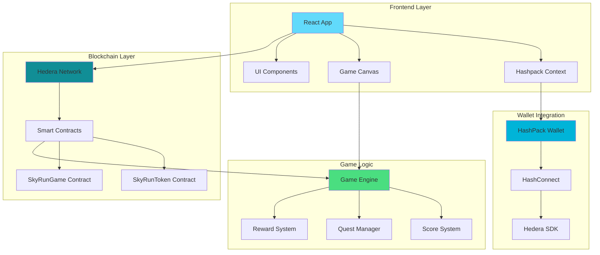
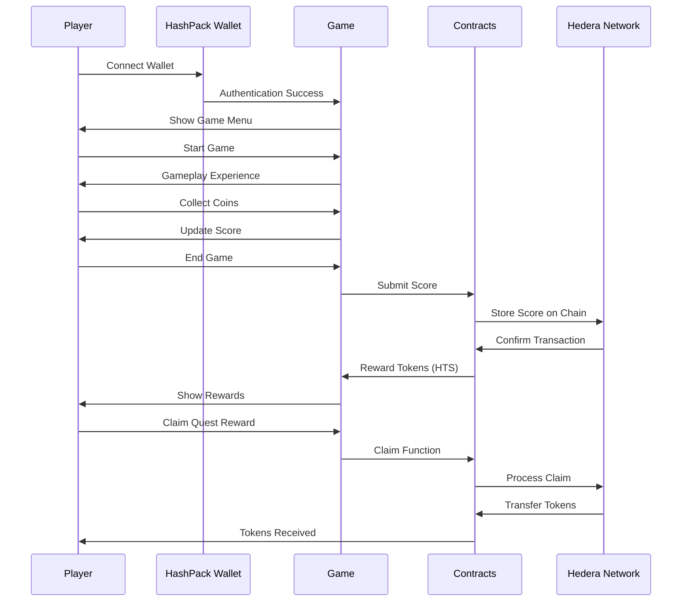
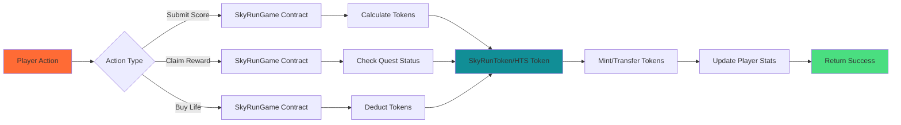
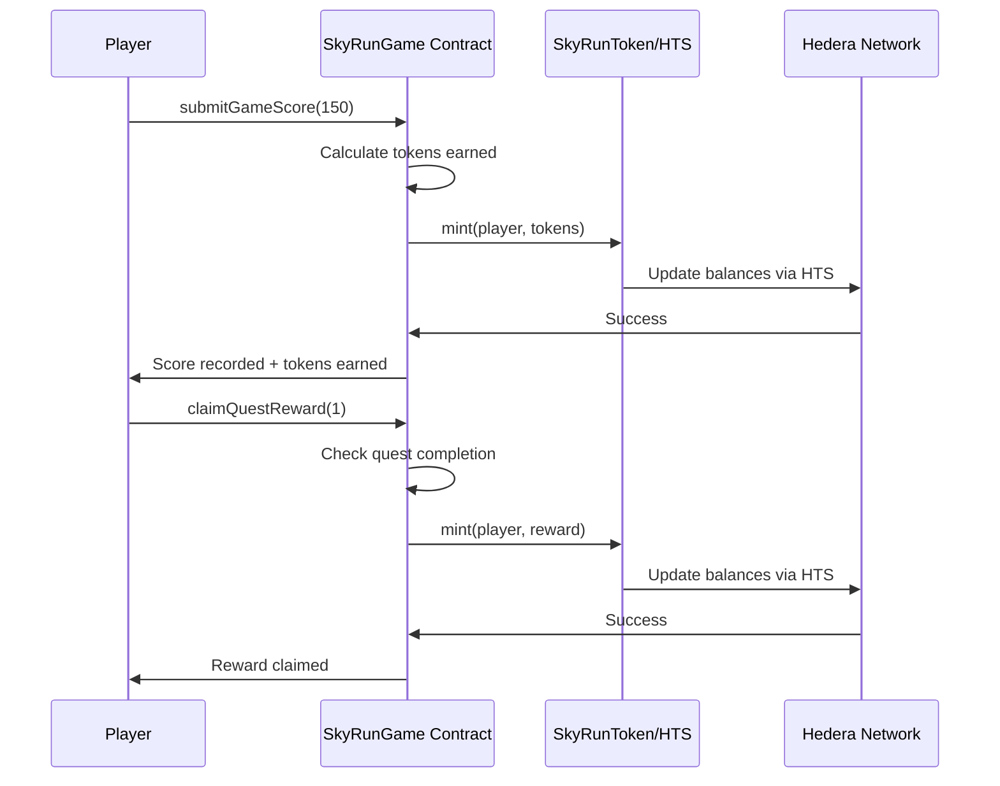

# 🎮 SkyRun - Blockchain-Powered Arcade Game on Hedera

<div align="center">


**A revolutionary arcade game that combines classic gameplay with cutting-edge Hedera blockchain technology**

[🚀 Live Demo](https://skyrun.app) | [📖 Documentation](docs/) | [🎯 Play Now](https://skyrun.app)

</div>

---

## 🌟 Overview

SkyRun is a next-generation arcade game that seamlessly integrates blockchain technology to create an immersive gaming experience. Players collect coins, complete quests, and earn real rewards through smart contracts deployed on the Hedera network.

### ✨ Key Features

- 🎮 **Classic Arcade Gameplay** - Intuitive controls and engaging mechanics
- 🔗 **Hedera Blockchain Integration** - Real rewards through Solidity smart contracts
- 🏆 **Quest System** - Complete challenges to earn tokens
- 💰 **Token Economy** - Earn and spend in-game tokens (HTS tokens)
- 🔐 **Wallet Integration** - Connect with HashPack wallet via HashConnect
- 📊 **Player Profiles** - Track your progress and achievements
- 🎨 **Modern UI/UX** - Beautiful, responsive design
- ⚡ **Fast Transactions** - Hedera's high-throughput, low-latency network

---

## 🏗️ Architecture

### System Architecture Diagram



### Technology Stack

| Layer | Technology | Purpose |
|-------|------------|---------|
| **Frontend** | React 19 + TypeScript | Modern UI framework |
| **Styling** | CSS3 + Modern Layout | Responsive design |
| **Blockchain** | Hedera Network | Smart contract platform |
| **Wallet** | HashPack + HashConnect | Wallet integration |
| **Contracts** | Solidity | Smart contract language |
| **Contract Platform** | Hedera EVM | Ethereum-compatible contracts |
| **Token Standard** | HTS (Hedera Token Service) | Native token integration |
| **Build Tool** | Vite | Fast development server |
| **SDK** | @hashgraph/sdk | Hedera SDK for transactions |

---

## 🔄 Game Flow

### Player Journey Flow



### Smart Contract Interaction Flow



---

## 📁 Project Structure

```
SkyRun/
├── 📁 public/                 # Static assets
│   ├── 📁 assets/             # Game assets (sprites, sounds, etc.)
│   │   ├── 📁 sprites/        # Character and obstacle sprites
│   │   ├── 📁 tiles/          # Game tiles and backgrounds
│   │   ├── 📁 audio/          # Sound effects and music
│   │   └── 📁 gui/            # UI elements
│   ├── 📁 scripts/            # Legacy game logic (if any)
│   └── 📄 index.html          # Main HTML file
├── 📁 src/                    # React source code
│   ├── 📁 components/         # React components
│   │   ├── GameMenu.tsx       # Main game menu
│   │   ├── WalletButton.tsx   # Wallet connection button
│   │   └── HederaActions.tsx  # Contract interaction component
│   ├── 📁 contexts/           # React contexts
│   │   └── HashpackContext.tsx # HashPack wallet state management
│   ├── 📁 hooks/              # Custom React hooks
│   ├── 📁 types/              # TypeScript type definitions
│   │   └── global.d.ts        # Global window types
│   ├── 📁 utils/              # Utility functions
│   │   ├── hederaClient.ts    # Hedera SDK client setup
│   │   ├── hederaHashpack.ts  # Contract interaction hooks
│   │   └── skyrun-contracts.ts # Contract addresses and ABIs
│   ├── App.tsx                # Main React component
│   ├── main.tsx               # React entry point
│   └── App.css                # Main styles
├── 📁 hedera/                 # Smart contracts (Solidity)
│   ├── 📁 contracts/          # Solidity contracts
│   │   ├── SkyRunGame.sol     # Main game contract
│   │   ├── SkyRunToken.sol    # Token contract
│   │   └── 📁 hts/            # Hedera Token Service interfaces
│   ├── 📁 scripts/            # Deployment scripts
│   │   └── deploy.ts          # Contract deployment script
│   ├── 📁 artifacts/          # Compiled contracts
│   └── hardhat.config.ts      # Hardhat configuration
├── 📄 package.json            # Node.js dependencies
├── 📄 vite.config.ts          # Vite configuration
└── 📄 README.md               # This file
```

---

## 🚀 Quick Start

### Prerequisites

- Node.js 18+ 
- npm or yarn
- HashPack wallet browser extension
- Git

### Installation

1. **Clone the repository**
   ```bash
   git clone https://github.com/KezzyNgotho/SKYRUN.git
   cd SkyRun
   ```

2. **Install dependencies**
   ```bash
   npm install
   ```

3. **Start development server**
   ```bash
   npm run dev
   ```

4. **Open in browser**
   ```
   http://localhost:5173
   ```

### First Time Setup

1. **Install HashPack Wallet**
   - Download from [HashPack.app](https://www.hashpack.app/download)
   - Create a new wallet or import existing
   - Switch to Hedera Testnet

2. **Get Testnet HBAR**
   - Visit [Hedera Portal](https://portal.hedera.com/)
   - Use the testnet faucet to get free testnet HBAR
   - Or use [Hedera Discord faucet](https://discord.gg/hedera)

3. **Connect Wallet**
   - Click "Connect Wallet" in the game
   - Approve the connection in HashPack
   - Start playing!

---

## 🎯 Smart Contracts

### Contract Overview

Our architecture uses **2 core contracts**:

#### 1. **SkyRunToken** (`SkyRunToken.sol`)
**Purpose**: HTS-compatible token for in-game currency

**Key Features:**
- HTS (Hedera Token Service) integration
- ERC-20 compatible interface
- Mintable by game contract
- Transferable between players

**Contract Address (Testnet):**
- Token: `0xBa69591B6890522084cC21CC3134051634706F04`

#### 2. **SkyRunGame** (`SkyRunGame.sol`)
**Purpose**: Main game logic, quests, and rewards

**Key Functions:**
- `submitGameScore(uint256 score)` - Submit score and earn tokens
- `claimQuestReward(uint256 questId)` - Claim completed quest rewards
- `buyLifeline()` - Purchase extra lives with tokens
- `useLifeline()` - Use a purchased lifeline
- `getUserStats(address user)` - Get player statistics
- `getQuest(uint256 questId)` - Get quest details
- `getQuestProgress(uint256 questId, address user)` - Get quest progress

**Contract Address (Testnet):**
- Game: `0xb4d36AA7305e6fC1a9bDCa236274cCd130D1382b`

**🔍 View on HashScan:**
- [HashScan - Testnet](https://hashscan.io/testnet)
- Search for contract addresses above

### Contract Functions

#### Game Functions (Player Actions)

```solidity
// Submit your game score and earn tokens
function submitGameScore(uint256 score) external;

// Claim a completed quest reward
function claimQuestReward(uint256 questId) external;

// Purchase extra lives with tokens
function buyLifeline() external;

// Use a purchased lifeline
function useLifeline() external;
```

#### View Functions (Read-Only)

```solidity
// Get player statistics
function getUserStats(address user) external view returns (Stats memory);

// Get available lives for a player
function getAvailableLives(address user) external view returns (uint256);

// Get token balance for a player
function getTokenBalance(address user) external view returns (uint256);

// Get quest details
function getQuest(uint256 questId) external view returns (Quest memory);

// Get quest progress for a player
function getQuestProgress(uint256 questId, address user) external view returns (Progress memory);

// Get total number of quests
function getTotalQuests() external view returns (uint256);
```

### Contract Integration Flow



---

## 🎯 Gameplay Guide

### Basic Controls

| Action | Control | Description |
|--------|---------|-------------|
| **Move** | Arrow Keys / WASD | Navigate your character |
| **Jump** | Spacebar | Jump over obstacles |
| **Collect** | Walk Over | Automatically collect coins |
| **Pause** | ESC | Pause the game |

### Scoring System

- **Coins Collected**: 1 point per coin
- **Distance Traveled**: 0.1 points per pixel
- **Obstacles Avoided**: 5 points per obstacle
- **Power-ups Used**: 2 points per power-up

### Quest System

| Quest Type | Description | Reward |
|------------|-------------|---------|
| **Score Quest** | Reach a target score | Token rewards |
| **Daily Quest** | Play daily for bonus | Bonus tokens |
| **Special Quest** | Limited-time challenges | Rare rewards |

---

## 🔐 Wallet Integration

### Supported Wallets

- **HashPack** (Primary) - Full Hedera ecosystem support
- **Blade Wallet** - Alternative Hedera wallet
- **HashConnect** - Universal wallet connector (v3)

### Integration Features

- **Automatic Detection** - Detects installed HashPack extension
- **Seamless Connection** - One-click wallet connection via HashConnect
- **Transaction Signing** - Secure contract interactions through wallet
- **Balance Display** - Real-time HBAR and token balances
- **Address Management** - Shortened address display (Account ID format)

### Security Features

- **Non-custodial** - Players control their own keys
- **Transaction Verification** - All transactions require user approval in wallet
- **Smart Contract Audits** - Contracts are verified on HashScan
- **Testnet First** - All features tested on Hedera Testnet before mainnet
- **Session Management** - Automatic session restoration and expiration handling

---

## 🎨 UI/UX Design

### Design Principles

- **Intuitive Navigation** - Easy-to-use interface
- **Responsive Design** - Works on all devices
- **Accessibility** - WCAG 2.1 compliant
- **Performance** - Optimized for speed
- **Modern Aesthetics** - Clean, contemporary design

### Color Scheme

| Color | Hex | Usage |
|-------|-----|-------|
| Primary Teal | `#118E96` | Main brand color (Hedera) |
| Secondary Blue | `#00B4D8` | Accent color |
| Success Green | `#4ade80` | Success states |
| Warning Orange | `#ff6b35` | Warnings |
| Error Red | `#ef4444` | Error states |
| Neutral Gray | `#6b7280` | Text and borders |

### Typography

- **Headings**: Inter Bold
- **Body Text**: Inter Regular
- **Code**: JetBrains Mono
- **UI Elements**: Inter Medium

---

## 🧪 Testing

### Running Tests

```bash
# Unit tests
npm run test

# Type checking
npm run type-check

# Linting
npm run lint

# Build for production
npm run build
```

### Test Scenarios

1. **Wallet Connection**
   - Successful connection
   - Connection failure
   - Wallet not installed

2. **Game Actions**
   - Score submission
   - Reward claiming
   - Life purchase

3. **Contract Interactions**
   - Transaction success
   - Transaction failure
   - Network errors

---

## 🚀 Deployment

### Development

```bash
# Start development server
npm run dev

# Build for production
npm run build

# Preview production build
npm run preview
```

### Production Deployment

#### Vercel (Recommended)

1. **Connect Repository**
   ```bash
   vercel --prod
   ```

2. **Configure Environment**
   - Set production contract addresses
   - Configure wallet settings (WalletConnect Project ID)
   - Set up analytics

#### Self-Hosted

1. **Build Application**
   ```bash
   npm run build
   ```

2. **Deploy to Server**
   ```bash
   # Copy dist/ folder to web server
   scp -r dist/ user@server:/var/www/skyrun/
   ```

### Contract Deployment

```bash
# Navigate to hedera directory
cd hedera

# Install dependencies
npm install

# Deploy to Hedera Testnet
npx hardhat run scripts/deploy.ts --network testnet

# Deploy to Hedera Mainnet
npx hardhat run scripts/deploy.ts --network mainnet
```

**Note:** Make sure you have:
- HBAR in your account for deployment fees
- Environment variables set for deployment keys
- Contract addresses updated in `src/utils/skyrun-contracts.ts`

---

## 📊 Analytics & Monitoring

### Metrics Tracked

- **User Engagement**: Daily active users, session duration
- **Game Performance**: FPS, load times, error rates
- **Blockchain Metrics**: Transaction success rates, fees (HBAR costs)
- **Wallet Usage**: Connection success rates, wallet types

### Monitoring Tools

- **Application**: Vercel Analytics (or similar)
- **Blockchain**: HashScan Explorer API
- **Errors**: Sentry error tracking
- **Performance**: Web Vitals monitoring

---

## 🤝 Contributing

We welcome contributions! Please see our [Contributing Guide](CONTRIBUTING.md) for details.

### Development Setup

1. **Fork the repository**
2. **Create a feature branch**
   ```bash
   git checkout -b feature/amazing-feature
   ```
3. **Make your changes**
4. **Run tests**
   ```bash
   npm run test
   npm run type-check
   npm run lint
   ```
5. **Commit your changes**
   ```bash
   git commit -m 'Add amazing feature'
   ```
6. **Push to your branch**
   ```bash
   git push origin feature/amazing-feature
   ```
7. **Open a Pull Request**

### Code Standards

- **TypeScript** - Strict type checking enabled
- **ESLint** - Code quality and consistency
- **Prettier** - Code formatting
- **Conventional Commits** - Standardized commit messages

---

## 📚 Documentation

### Additional Resources

- [📖 Hedera Documentation](https://docs.hedera.com/)
- [🎮 HashPack Wallet Docs](https://docs.hashpack.app/)
- [🔗 HashConnect Guide](https://www.hashconnect.dev/)
- [⚡ Hedera SDK Reference](https://docs.hedera.com/hedera/sdks-and-apis/sdks)
- [🔍 HashScan Explorer](https://hashscan.io/)

### Community

- [💬 Hedera Discord](https://discord.gg/hedera)
- [🐦 Twitter](https://twitter.com/hedera)
- [📰 Hedera Blog](https://hedera.com/blog)

---

## 📄 License

This project is licensed under the MIT License - see the [LICENSE](LICENSE) file for details.

---

## 🙏 Acknowledgments

- **Hedera Network** - For the amazing blockchain platform
- **HashPack Team** - For wallet integration support
- **React Community** - For the excellent framework
- **Open Source Contributors** - For their valuable contributions

---

## 📞 Support

Need help? We're here for you!

- **🐛 Issues**: [Report bugs](https://github.com/KezzyNgotho/SKYRUN/issues)
- **💡 Ideas**: [Request features](https://github.com/KezzyNgotho/SKYRUN/discussions)
- **💬 Hedera Discord**: [Join the community](https://discord.gg/hedera)

---

<div align="center">

**Made with ❤️ by the SkyRun Team**

[⭐ Star this repo](https://github.com/KezzyNgotho/SKYRUN) | [🎮 Play SkyRun](https://skyrun.app) | [💬 Join Discord](https://discord.gg/hedera)

</div>
