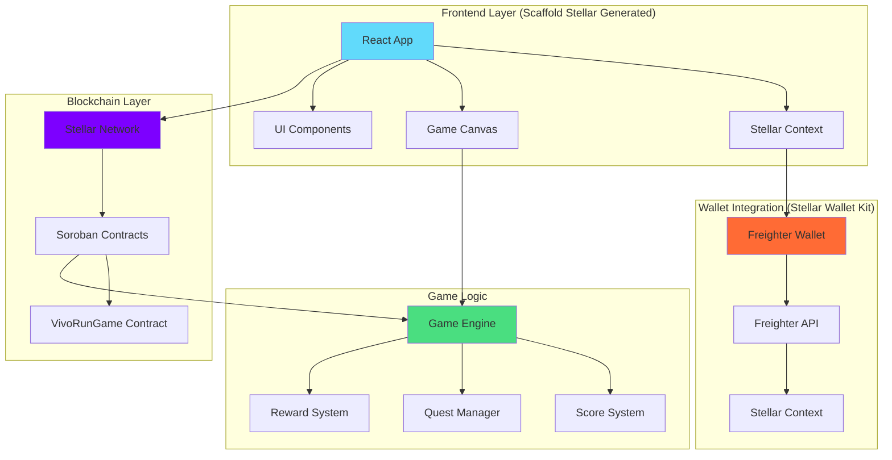

# 🎮 VIVO RUN - Scaffold Stellar Hackathon Submission

<div align="center">


**A high-speed arcade dApp showcasing the speed and efficiency of Scaffold Stellar framework**

Built for the Scaffold Stellar Hackathon - Demonstrating Rust smart contracts, React frontend, and Stellar Wallet Kit integration

[🚀 Live Demo](https://vivorun.app) | [📖 Documentation](docs/) | [🎯 Play Now](https://vivorun.app)

</div>

---

## 🌟 Overview

VIVO RUN is a blockchain-powered arcade game built with **Scaffold Stellar** to demonstrate the framework's speed and efficiency. Players run, jump, and collect coins while earning real rewards through Soroban smart contracts deployed on the Stellar network.

### ✨ Key Features

- 🎮 **Classic Arcade Gameplay** - Fast-paced runner game with intuitive controls
- 🔗 **Stellar Soroban Integration** - Smart contracts written in Rust, compiled to WebAssembly
- 🏆 **Quest System** - Complete challenges to earn tokens
- 💰 **Token Economy** - Earn and spend in-game tokens
- 🔐 **Stellar Wallet Kit** - Seamless Freighter wallet integration
- 📊 **Player Profiles** - Track your progress on-chain
- 🎨 **Modern UI/UX** - Beautiful, responsive design built with React + Vite
- ⚡ **Lightning Fast** - Demonstrates Scaffold Stellar's efficiency

---

## 🏗️ Scaffold Stellar Framework Components

This project demonstrates all three required components for the Scaffold Stellar hackathon:

### ✅ 1. Deployed Smart Contract

**Location:** `contracts/vivo_run_game/`

- **Language:** Rust
- **Platform:** Soroban (Stellar's smart contract platform)
- **Compilation:** WebAssembly (WASM)
- **Contract:** `VivoRunGame` - Handles player stats, quests, and token rewards

**Key Functions:**
- `submit_game_score(player, score)` - Submit score and earn tokens
- `get_player_stats(player)` - Get player statistics
- `claim_quest_reward(player, quest_id)` - Claim quest rewards
- `buy_lifeline(player)` - Purchase extra lives

### ✅ 2. Front End

**Location:** `src/`

- **Framework:** React 19 + TypeScript
- **Build Tool:** Vite (as generated by Scaffold Stellar)
- **Components:**
  - `GameMenu.tsx` - Main game menu
  - `StellarWalletButton.tsx` - Wallet connection button
  - `App.tsx` - Main application component

### ✅ 3. Stellar Wallet Kit Integration

**Location:** `src/contexts/StellarContext.tsx`

- **Wallet:** Freighter (via `@stellar/freighter-api`)
- **Integration:** Full wallet connection, transaction signing, and state management
- **Features:**
  - Automatic wallet detection
  - One-click connection
  - Transaction signing for contract interactions
  - Real-time connection status

---

## 🏗️ Architecture

### System Architecture



### Technology Stack

| Layer | Technology | Purpose |
|-------|------------|---------|
| **Frontend** | React 19 + TypeScript | Modern UI framework (Scaffold Stellar) |
| **Styling** | CSS3 + Modern Layout | Responsive design |
| **Blockchain** | Stellar Network | Smart contract platform |
| **Smart Contracts** | Rust → WebAssembly | Soroban contracts |
| **Wallet** | Freighter + Stellar Wallet Kit | Wallet integration |
| **Build Tool** | Vite | Fast development server (Scaffold Stellar) |
| **Contract Framework** | Scaffold Stellar | Project scaffolding and tooling |

---

## 🚀 Quick Start

### Prerequisites

- Node.js 18+ 
- Rust and Cargo (for building contracts)
- Freighter wallet browser extension
- Git

### Installation

1. **Clone the repository**
   ```bash
   git clone https://github.com/KezzyNgotho/VIVO-RUN.git
   cd VIVO-RUN
   ```

2. **Install dependencies**
   ```bash
   npm install
   ```

3. **Start development server**
   ```bash
   npm run dev
   ```

4. **Open in browser**
   ```
   http://localhost:5173
   ```

### First Time Setup

1. **Install Freighter Wallet**
   - Download from [Freighter.app](https://freighter.app/)
   - Create a new wallet or import existing
   - Switch to Stellar Testnet

2. **Get Testnet XLM**
   - Visit [Stellar Laboratory](https://laboratory.stellar.org/#account-creator?network=test)
   - Create a test account and fund it with testnet XLM

3. **Connect Wallet**
   - Click "Connect Stellar Wallet" in the game
   - Approve the connection in Freighter
   - Start playing!

---

## 📋 Smart Contracts

### Contract Overview

**VivoRunGame Contract** (`contracts/vivo_run_game/src/lib.rs`)

A Soroban smart contract written in Rust that manages:
- Player statistics (games played, scores, tokens earned)
- Quest system (tracking progress and rewards)
- Token rewards (minting based on game performance)
- Lifeline purchases (buy extra lives with tokens)

### Building Contracts

```bash
# Build all contracts
npm run contracts:build

# Or manually
cd contracts
cargo build --target wasm32-unknown-unknown --release
```

### Deploying Contracts

```bash
# Deploy to Stellar Testnet
npm run contracts:deploy:testnet

# Deploy to Stellar Mainnet
npm run contracts:deploy:mainnet
```

**Note:** Make sure you have:
- Stellar CLI installed (`cargo install --locked --git https://github.com/stellar/stellar-cli stellar-cli`)
- Testnet XLM in your account for deployment fees
- Contract address set in `.env` file

### Contract Functions

#### Player Functions

```rust
// Submit a game score and earn tokens
pub fn submit_game_score(env: Env, player: Address, score: u64)

// Get player statistics
pub fn get_player_stats(env: Env, player: Address) -> PlayerStats

// Claim a quest reward
pub fn claim_quest_reward(env: Env, player: Address, quest_id: u32)

// Buy a lifeline (costs 10 tokens)
pub fn buy_lifeline(env: Env, player: Address)
```

#### Admin Functions

```rust
// Initialize contract with token address
pub fn initialize(env: Env, token: Address)

// Create a new quest
pub fn create_quest(env: Env, quest_id: u32, title: Symbol, description: Symbol, reward_amount: u64, target_score: u64)
```

---

## 🎯 Gameplay Guide

### Basic Controls

| Action | Control | Description |
|--------|---------|-------------|
| **Move** | Arrow Keys / WASD | Navigate your character |
| **Jump** | Spacebar | Jump over obstacles |
| **Collect** | Walk Over | Automatically collect coins |
| **Pause** | ESC | Pause the game |

### Scoring System

- **Coins Collected**: 1 point per coin
- **Distance Traveled**: 0.1 points per pixel
- **Obstacles Avoided**: 5 points per obstacle
- **Power-ups Used**: 2 points per power-up

### Quest System

| Quest Type | Description | Reward |
|------------|-------------|---------|
| **Score Quest** | Reach a target score | Token rewards |
| **Daily Quest** | Play daily for bonus | Bonus tokens |
| **Special Quest** | Limited-time challenges | Rare rewards |

---

## 🔐 Stellar Wallet Kit Integration

### Supported Wallets

- **Freighter** (Primary) - Full Stellar ecosystem support
- **Stellar Wallet Kit** - Integrated via `@stellar/freighter-api`

### Integration Features

- **Automatic Detection** - Detects installed Freighter extension
- **Seamless Connection** - One-click wallet connection
- **Transaction Signing** - Secure contract interactions through wallet
- **Balance Display** - Real-time XLM and token balances
- **Address Management** - Shortened address display

### Security Features

- **Non-custodial** - Players control their own keys
- **Transaction Verification** - All transactions require user approval in wallet
- **Smart Contract Audits** - Contracts are verified on Stellar
- **Testnet First** - All features tested on Stellar Testnet before mainnet

---

## 🧪 Testing

### Running Tests

```bash
# Unit tests
npm run test

# Contract tests
npm run contracts:test

# Type checking
npm run type-check

# Linting
npm run lint

# Build for production
npm run build
```

---

## 🚀 Deployment

### Development

```bash
# Start development server
npm run dev

# Build for production
npm run build

# Preview production build
npm run preview
```

### Production Deployment

#### Vercel (Recommended)

1. **Connect Repository**
   ```bash
   vercel --prod
   ```

2. **Configure Environment**
   - Set `VITE_STELLAR_CONTRACT_ID` with your deployed contract address
   - Set `VITE_STELLAR_NETWORK` (testnet or mainnet)

### Contract Deployment

```bash
# Build contracts first
npm run contracts:build

# Deploy to Stellar Testnet
npm run contracts:deploy:testnet

# Deploy to Stellar Mainnet
npm run contracts:deploy:mainnet
```

---

## 📁 Project Structure

```
VIVO-RUN/
├── 📁 contracts/              # Soroban smart contracts (Rust)
│   ├── 📁 vivo_run_game/      # Main game contract
│   │   ├── src/
│   │   │   ├── lib.rs         # Contract implementation
│   │   │   └── test.rs        # Contract tests
│   │   └── Cargo.toml         # Rust dependencies
│   └── Cargo.toml             # Workspace configuration
├── 📁 src/                    # React frontend (Scaffold Stellar)
│   ├── 📁 components/         # React components
│   │   ├── GameMenu.tsx       # Main game menu
│   │   └── StellarWalletButton.tsx  # Wallet connection
│   ├── 📁 contexts/           # React contexts
│   │   └── StellarContext.tsx # Stellar wallet state management
│   ├── 📁 utils/              # Utility functions
│   │   ├── stellar-client.ts  # Stellar SDK client setup
│   │   └── stellar-contracts.ts # Contract addresses and types
│   ├── App.tsx                # Main React component
│   └── main.tsx               # React entry point
├── 📁 public/                 # Static assets
│   ├── 📁 assets/             # Game assets (sprites, sounds, etc.)
│   └── 📁 scripts/            # Legacy game logic
├── 📁 scripts/                # Deployment scripts
│   └── deploy-contract.sh     # Contract deployment script
├── 📄 package.json            # Node.js dependencies
├── 📄 vite.config.ts          # Vite configuration
└── 📄 README.md               # This file
```

---

## 🎯 Scaffold Stellar Framework Benefits

This project demonstrates the key advantages of Scaffold Stellar:

1. **⚡ Speed** - Fast project setup and development workflow
2. **🔧 Efficiency** - Eliminates boilerplate with generated project structure
3. **🦀 Rust Contracts** - Type-safe smart contracts compiled to WASM
4. **⚛️ Modern Frontend** - React + TypeScript + Vite out of the box
5. **🔗 Wallet Integration** - Stellar Wallet Kit included in template
6. **📦 All-in-One** - Complete dApp structure in one command

---

## 📚 Documentation

### Additional Resources

- [📖 Stellar Documentation](https://developers.stellar.org/)
- [🦀 Soroban Documentation](https://soroban.stellar.org/docs)
- [🔧 Scaffold Stellar Guide](https://developers.stellar.org/docs/tools/developer-tools/scaffold-stellar)
- [🔗 Freighter Wallet Docs](https://freighter.app/docs)
- [⚡ Stellar SDK Reference](https://developers.stellar.org/docs/sdks)

### Community

- [💬 Stellar Discord](https://discord.gg/stellar)
- [🐦 Twitter](https://twitter.com/stellarorg)
- [📰 Stellar Blog](https://www.stellar.org/blog)

---

## 📄 License

This project is licensed under the MIT License - see the [LICENSE](LICENSE) file for details.

---

## 🙏 Acknowledgments

- **Stellar Development Foundation** - For the amazing blockchain platform
- **Scaffold Stellar Team** - For the excellent developer toolkit
- **Freighter Team** - For wallet integration support
- **React Community** - For the excellent framework
- **Open Source Contributors** - For their valuable contributions

---

## 📞 Support

Need help? We're here for you!

- **🐛 Issues**: [Report bugs](https://github.com/KezzyNgotho/VIVO-RUN/issues)
- **💡 Ideas**: [Request features](https://github.com/KezzyNgotho/VIVO-RUN/discussions)
- **💬 Stellar Discord**: [Join the community](https://discord.gg/stellar)

---

<div align="center">

**Made with ❤️ for the Scaffold Stellar Hackathon**

[⭐ Star this repo](https://github.com/KezzyNgotho/VIVO-RUN) | [🎮 Play VIVO RUN](https://vivorun.app) | [💬 Join Discord](https://discord.gg/stellar)

</div>
